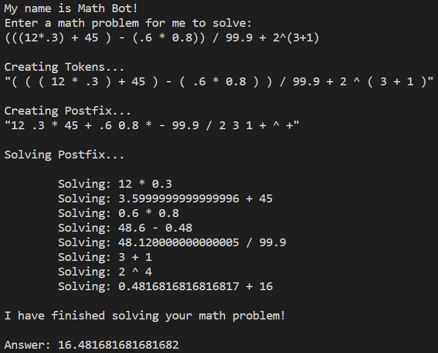
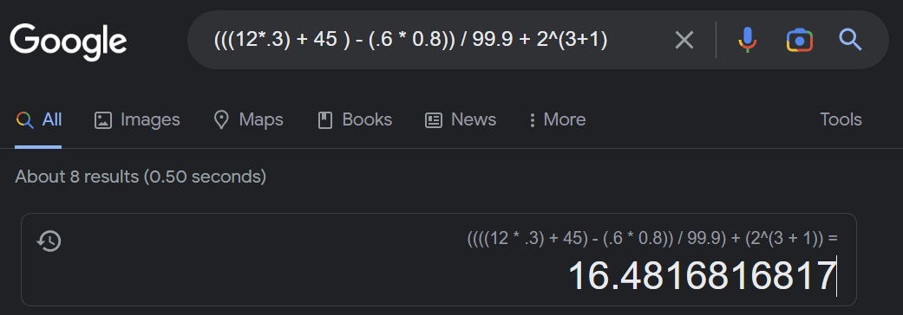

# Math Solver

> This project is a work in progress

## Demo

In this demo we solve: `(((12*.3) + 45 ) - (.6 * 0.8)) / 99.9 + 2^(3+1)`

Compare this to the real answer

---

## What

A console application that attempts to solve math problems.

### How

1. Generate tokens based on user input to break their math problem
2. Organize tokens into postfix notation using the Shunting Yard Algorithm
3. Evaluate tokens in postfix notation and generate an answer

---

## Why

I am learning Rust and thought this would be a good project to practice it with.
